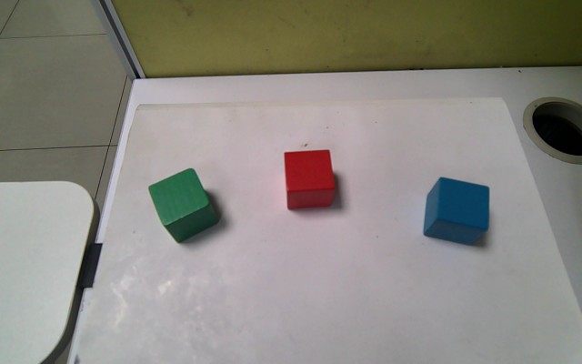
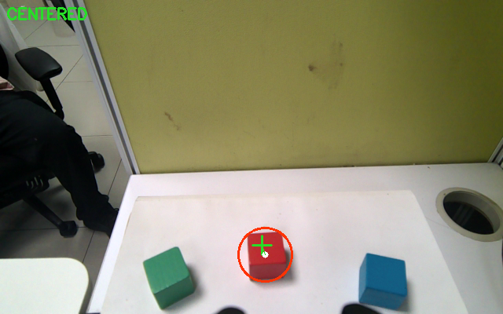
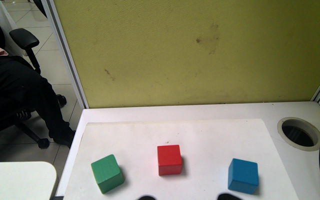
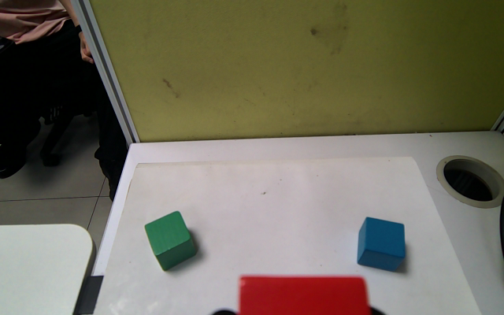
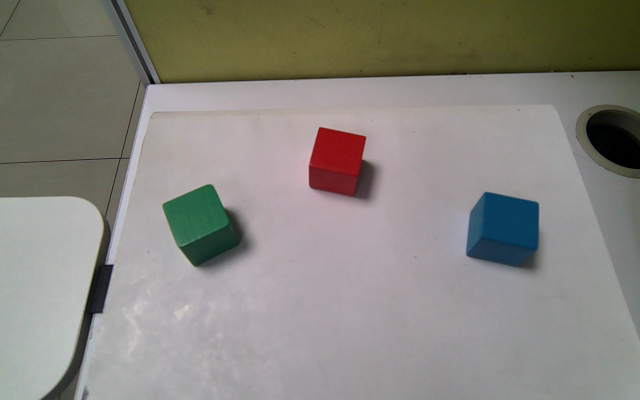

# 如何开发 Agent App

这一节完整演示如何从零开发一个 Agent App。我们要开发的 Agent 叫 **彩色积木抓取 Agent**：用户用自然语言说“夹起红色积木”，Agent 负责理解任务、确认风险、调用视觉识别、控制机械臂和夹爪完成抓取，再验证积木确实被夹住，最后根据计划保持夹持或放到指定位置并保存执行记录。

这个 Agent 不是 ROS2 节点，不直接订阅相机 topic，不直接调用 MoveIt，也不自己发布 `/cmd_vel`。它只做任务编排：所有真实机器人动作都通过 Runtime 的 SDK 和 system skills 进入权限检查、资源锁、安全守卫和审计日志。

## 最终用户会怎么用

用户给 App 一句话：

```text
夹起红色积木
```

App 预期完成的事情：

1. 让 Runtime LLM 把这句话转换成结构化计划。
2. 校验计划只能选择允许的颜色和步骤。
3. 检查 App manifest 是否声明了所需权限。
4. 请求人工确认，因为真实抓取和放置属于高风险动作。
5. 检查机器人、机械臂、夹爪和视觉 backend 是否可用。
6. 通过感知 system skill 让相机找到目标颜色积木。
7. 通过机械臂和夹爪 system skill 抓起积木。
8. 通过视觉 system skill 验证积木确实被夹住。
9. 按计划保持夹持状态或将积木放到目标位置。
10. 把结果写入 memory、storage，并通过 report 输出状态。

失败时也要返回结构化错误，例如：

```json
{
  "success": false,
  "error_code": "COLOR_BLOCK_DETECTION_INVALID",
  "reason": "color block detection data is incomplete",
  "missing": ["center_px", "camera_position_m"],
  "next_action": "Verify the perception bridge returns validated detection fields."
}
```

## 要创建哪些文件

一个可维护的 Agent App 至少包含这些文件：

```text
agentic_apps/color_block_grasper_agent/
  app.yaml
  main.py
  prompts/system.md
  workflows/default.yaml
  skills/find_best_block/
    SKILL.md
    impl.py
  storage/.gitkeep
  tests/
```

每个文件的作用：

| 文件 | 作用 |
| --- | --- |
| `app.yaml` | 声明 App 名称、入口函数、权限、所需能力、资源和安全策略 |
| `main.py` | Agent 的主流程，负责任务解析、校验、skill 调用、错误处理和结果保存 |
| `prompts/system.md` | 给 LLM 的规划提示词，约束它必须返回 JSON plan |
| `workflows/default.yaml` | 给开发者和运行时工具看的步骤清单 |
| `skills/find_best_block/SKILL.md` | App 私有 skill 的 contract |
| `skills/find_best_block/impl.py` | App 私有 skill 的 Python 后端实现 |
| `storage/.gitkeep` | 保留 App storage 目录 |
| `tests/` | manifest、边界、错误码和真实依赖测试 |

## 第一步：定义 Agent 要解决的问题

先不要写代码，先定义任务边界。这个 Agent 只解决“彩色积木抓取和放置”：

输入：

```text
用户自然语言任务，例如“夹起红色积木”
```

允许的颜色：

```text
以 App manifest 和 system skill contract 中的颜色 allowlist 为准；本教程固定使用 red。
```

允许的目标：

```text
workspace 或 App manifest 中允许的 place target
```

输出：

```json
{
  "success": true,
  "planner_mode": "llm",
  "detection": {},
  "pick": {},
  "post_pick_verification": {},
  "place": {},
  "syscall_ids": [],
  "audit_ids": []
}
```

边界：

- LLM 只能做规划，不能直接控制机器人。
- App 不实现 ROS2 bridge。
- App 不直接调用相机、机械臂、夹爪或 MoveIt。
- 视觉识别、抓取、放置都通过 system skill。
- App 可以写 app skill 做本应用内部的纯业务逻辑，例如候选积木排序。

## 第二步：写 app.yaml

`app.yaml` 是 Runtime 判断这个 App 能不能调用某项能力的依据。写 App 时，先把它需要的能力写清楚。

```yaml
name: color_block_grasper_agent
version: 0.1.0
description: Detect, pick, verify, and place a requested color block through Runtime-controlled robot capabilities.
entrypoint: main:run
```

`entrypoint: main:run` 表示 Runtime 会加载 `main.py`，调用里面的 `run(ctx, **kwargs)`。

接着声明权限：

```yaml
permissions:
  - llm.external.call
  - robot.state.read
  - robot.stop
  - perception.observe
  - perception.capture
  - perception.detect.color_block
  - perception.center.color_block
  - perception.verify.color_block_held
  - arm.state.read
  - arm.move.named
  - gripper.control
  - manipulation.pick.color_block
  - manipulation.place.color_block
  - human.ask
  - context.write
  - context.read
  - memory.write
  - memory.read
  - storage.read
  - storage.write
  - report.say
```

这些权限和代码里的调用要一一对应。例如代码里调用 `manipulation.pick_color_block`，manifest 里就必须有 `manipulation.pick.color_block`。

再声明资源：

```yaml
resources:
  - camera
  - arm
  - gripper
  - color_block_detector
  - color_block_centering
  - held_color_block_verifier
  - manipulation_backend
```

这些资源会被 Runtime 和 skill contract 用来做资源锁。例如抓取时会锁住 `arm`、`gripper`、`camera` 和 `manipulation_backend`，避免两个任务同时抢同一套硬件。

安全策略必须明确：

```yaml
safety_policy:
  allow_autonomous_navigation: false
  allow_manipulation: true
  require_human_confirmation_for:
    - manipulation.pick_color_block
    - manipulation.place_color_block
    - gripper.set
    - arm.move_named
  forbidden_zones: []
  max_task_duration_s: 180
```

这里的含义是：这个 App 不允许自主导航，但允许受控机械臂操作；抓取、放置、夹爪和机械臂动作都必须有人确认。

## 第三步：写入口函数

入口函数固定接收 Runtime 注入的 `AgentContext`：

```python
from agentic_runtime.sdk import AgentContext


async def run(ctx: AgentContext, **kwargs) -> dict:
    ...
```

第一件事是读取用户任务：

```python
task_text = str(
    kwargs.get("task_text")
    or kwargs.get("message")
    or kwargs.get("text")
    or ""
).strip()

if not task_text:
    return {
        "success": False,
        "error_code": "COLOR_BLOCK_LLM_PLAN_REQUIRED",
        "reason": "natural language task_text or message is required",
        "missing": ["task_text"],
        "next_action": "Provide a natural language color-block manipulation request and rerun.",
    }
```

这里不要默认替用户编造任务。没有自然语言输入就失败，因为这个 App 的设计是由 LLM 做任务规划。

## 第四步：让 LLM 输出计划，而不是控制机器人

App 调用 Runtime 提供的 LLM facade：

```python
plan_result = await ctx.llm.chat_json(
    system_prompt=_system_prompt(),
    user_prompt=f"User task: {task_text}",
    timeout_s=30,
)
```

system prompt 要求 LLM 只返回 JSON，例如：

```json
{
  "schema_version": "1.0",
  "planner_mode": "llm",
  "target_color": "red",
  "place_target": "hold_position",
  "requires_manipulation": true,
  "needs_confirmation": true,
  "steps": [
    "prepare_arm_pose",
    "center_color_block",
    "detect_color_block",
    "capture_evidence",
    "pick_color_block",
    "reset_arm_home_holding_gripper",
    "post_pick_verify",
    "place_color_block"
  ],
  "risk_class": "controlled_manipulation",
  "user_summary": "夹起红色积木。"
}
```

然后用确定性代码校验：

```python
ALLOWED_COLORS = {"red"}  # 本教程固定演示 red；生产环境按 manifest/skill contract 扩展
PLAN_STEPS = [
    "prepare_arm_pose",
    "center_color_block",
    "detect_color_block",
    "capture_evidence",
    "pick_color_block",
    "reset_arm_home_holding_gripper",
    "post_pick_verify",
    "place_color_block",
]


def validate_plan(plan: dict) -> dict:
    # schema_version 用来防止 LLM 返回旧格式或完全无关的 JSON。
    if plan.get("schema_version") != "1.0":
        return {"success": False, "error_code": "COLOR_BLOCK_LLM_PLAN_INVALID"}

    # 颜色必须在 App 明确允许的集合内，不能让 LLM 自己发明 purple/orange。
    if plan.get("target_color") not in ALLOWED_COLORS:
        return {"success": False, "error_code": "COLOR_BLOCK_LLM_PLAN_INVALID"}

    # 步骤顺序必须固定。LLM 不能跳过确认、跳过验证，或者把 place 放到 pick 前面。
    if plan.get("steps") != PLAN_STEPS:
        return {"success": False, "error_code": "COLOR_BLOCK_LLM_PLAN_INVALID"}

    # 只要涉及真实机械臂，就必须显式标记为 manipulation 任务。
    if plan.get("requires_manipulation") is not True:
        return {"success": False, "error_code": "COLOR_BLOCK_LLM_PLAN_INVALID"}

    # 高风险动作必须人工确认，不能由 LLM 决定自动执行。
    if plan.get("needs_confirmation") is not True:
        return {"success": False, "error_code": "COLOR_BLOCK_LLM_PLAN_INVALID"}

    return {"success": True}
```

关键点：LLM 可以决定“用户想抓红色积木”，但不能决定“跳过确认”或“直接移动机械臂”。这些必须由代码和 Runtime 安全策略控制。

## 第五步：把计划转换成任务对象

验证通过后，把 plan 转成 App 内部 task：

```python
task = {
    # 原始用户输入，后续写入 storage/audit，方便复盘。
    "task_text": task_text,

    # 标记本次计划来自 Runtime LLM facade，而不是硬编码参数。
    "planner_mode": "llm",

    # 保存完整 plan，便于调试 LLM 输出。
    "plan": plan,

    # 后续所有 perception/manipulation skill 都使用这个颜色。
    "color": plan["target_color"],

    # target 是感知目标区域，默认 workspace。
    "target": plan.get("target") or "workspace",

    # place_target 是放置目标，但仍要被 App 和 bridge/profile allowlist 约束。
    "place_target": plan["place_target"],

    "requires_manipulation": True,
    "needs_confirmation": True,

    # evidence_label 会出现在图片、metadata、storage 记录里。
    "evidence_label": plan.get("evidence_label") or f"{plan['target_color']}_block_grasp",

    # 整体任务超时，避免真实机器人任务无限挂起。
    "timeout_s": int(plan.get("timeout_s") or 180),

    # 风险等级进入安全策略和审计。
    "risk_class": plan["risk_class"],
}
```

这个 task 会贯穿后续所有步骤：视觉识别要知道 `color`，抓取要用 detection，放置要用 `place_target`，结果保存要记录整个 task。

## 第六步：先做权限和人工确认

代码执行前先检查 manifest 里是否有必要权限：

```python
required_permissions = [
    "perception.detect.color_block",
    "perception.center.color_block",
    "perception.capture",
    "perception.verify.color_block_held",
    "manipulation.pick.color_block",
    "manipulation.place.color_block",
    "human.ask",
]

missing = [
    permission
    for permission in required_permissions
    if permission not in ctx.app_manifest.permissions
]
if missing:
    return {
        "success": False,
        "error_code": "COLOR_BLOCK_CAPABILITY_UNAVAILABLE",
        "missing": missing,
    }
```

然后让 operator 确认真实抓取：

```python
confirmation = await ctx.kernel.skill.call(
    "human.ask",
    {
        "question": f"Confirm real manipulation: pick the {task['color']} block and place it at {task['place_target']}.",
        "options": ["CONFIRM", "CANCEL"],
        "require_confirmation": True,
        "timeout_s": 60,
    },
    timeout_s=60,
)
```

只有回答 `CONFIRM` 才继续。未确认时返回 `COLOR_BLOCK_CONFIRMATION_REQUIRED`。

真实运行开始前，App 通常会先拍一张 precheck 画面，用来证明相机、工作区和目标物体状态都可追溯。下面这张图里可以看到三块不同颜色的积木都在工作台上，后续任务选择红色积木作为目标。



_运行前证据：相机已经能看到工作区，红色积木位于中间区域，后续视觉对中和检测都基于这一路 RGB/depth 相机。_

## 第七步：统一封装 system skill 调用

为了让每个步骤都保留 audit 信息，建议统一写一个 helper：

```python
async def call_skill(ctx, steps, name: str, skill_name: str, args: dict) -> dict:
    # 所有 system skill 都从这里进入 Runtime。
    # 这样每一步都会经过权限、资源锁、安全检查和审计，而不是散落在业务代码里。
    result = await ctx.kernel.skill.call(skill_name, args, timeout_s=args.get("_kernel_timeout_s", 10))

    # 把 Runtime 返回值归一化成统一的 step 记录，方便后面保存报告、排查失败原因。
    step = {
        "name": name,                         # App 内部步骤名，例如 detect_color_block
        "skill": skill_name,                  # Runtime system skill 名，例如 perception.detect_color_block
        "success": bool(result.success),      # 当前步骤是否成功
        "error_code": result.error_code,      # 结构化错误码，失败时不要只返回自然语言
        "data": result.response or {},        # bridge 或 runtime 返回的结构化结果
        "syscall_id": result.syscall_id,      # kernel syscall 追踪 ID
        "audit_id": result.audit_id,          # audit log 追踪 ID
    }

    # steps 是整次任务的时间线。失败时可以直接看最后一个 step。
    steps.append(step)
    return step
```

后续所有视觉、机械臂、夹爪、抓取、放置动作都通过这个 helper 调 system skill。

当 App 调用：

```python
await ctx.kernel.skill.call("perception.detect_color_block", {"color": "red"})
```

Runtime 不会把调用直接交给机器人。它会先走一遍系统执行链路：

1. 从 skill registry 找到对应的 system skill contract。
2. 用 `input_schema` 校验参数，例如 `color` 必须属于 system skill contract 的颜色 allowlist；本教程传入 `red`。
3. 用 App manifest 做 permission check，例如必须有 `perception.detect.color_block`。
4. 对高风险或资源相关能力做 access/intervention check。
5. 调 safety guard，例如机械臂动作要确认急停、最大时长、工作空间约束。
6. 根据 `resource_requirements.locks` 锁资源，例如 `camera`、`arm`、`gripper`。
7. 根据 `implementation.type` 选择 runner：`ros2_service`、`ros2_action`、`runtime_internal` 或 `python`。
8. 创建 syscall/audit 记录，执行完成后释放资源锁。

例如视觉检测 skill 的 runner 配置会指向 bridge service，并声明哪些 JSON 字段要解析回 App：

```json
{
  "type": "ros2_service",
  "service": "/agentic/perception/detect_color_block",
  "service_type": "agentic_msgs/srv/DetectColorBlock",
  "request_id_field": "request_id",
  "json_output_fields": {
    "detection": "detection_json",
    "evidence": "evidence_json"
  }
}
```

这就是为什么 App 代码只看到普通 dict，但底层仍然走了权限、安全、资源锁、审计和 ROS2 bridge。

## 第八步：完成视觉识别

视觉识别分三层理解：

| 层 | 负责什么 | 在哪里 |
| --- | --- | --- |
| App 编排层 | 决定要识别什么颜色、何时拍照、如何校验结果 | `main.py` |
| System skill contract | 定义输入、输出、权限、资源锁、安全约束 | `agentic_runtime_src/system_skills/perception.*` |
| Bridge/backend | 真正调用相机、检测算法或 ROS2 service | ROS2 bridge workspace |

视觉相关 bridge 在：

```text
ros2_bridge_src/agentic_capability_bridge/agentic_capability_bridge/inspection_bridge_node.py
```

它订阅 robot profile 中配置的 RGB、depth、CameraInfo topic，并向 Runtime 暴露这些 service：

```text
/agentic/perception/capture_photo
/agentic/perception/detect_color_block
/agentic/perception/center_color_block
/agentic/perception/verify_held_color_block
```

App 不直接读相机。它调用 system skill：

```python
center = await call_skill(
    ctx,
    steps,
    "center_color_block",
    "perception.center_color_block",
    {
        "color": task["color"],
        "target": task["target"],
        "evidence_label": f"{task['evidence_label']}_center",
        "timeout_s": 12,
        "_kernel_timeout_s": 45,
    },
)
```

`perception.center_color_block` 的目标是让目标颜色积木进入可抓取的视觉区域。它可能通过相机、机械臂预设姿态或视觉 backend 完成居中，但这些细节都在 Runtime/bridge 里，App 只看结构化结果。



_视觉对中证据：红圈是 OpenCV 分割出的红色候选块，十字标记是目标中心点。`CENTERED` 表示候选中心已经进入 profile 配置的容差范围。_

`perception.center_color_block` 对应 bridge service：

```text
/agentic/perception/center_color_block
agentic_msgs/srv/CenterColorBlock
```

这一步不是简单“检测一次”，而是一个慢速视觉对中循环：

1. 检查 servo command topic 是否有 subscriber。
2. 读取 profile 中的目标中心比例，例如 `center_target_x_ratio`、`center_target_y_ratio`。
3. 每轮读取一帧 RGB 图像，并用 OpenCV LAB 分割找到目标颜色块。
4. 计算目标中心和画面目标中心之间的 `dx`、`dy`。
5. 用 profile 中的 gain、max step 和 pulse limits 计算 base/pitch servo pulse 调整量。
6. 发布 `servo_controller_msgs/ServosPosition`，调整底座和相机俯仰。
7. 等待 settle 时间，继续下一轮。
8. 进入 tolerance 范围后返回 `centered: true`。
9. 超时或迭代次数用尽则返回 `COLOR_BLOCK_ALIGNMENT_FAILED`。

核心代码可以理解成“感知误差 -> 受限舵机调整”：

```python
# observation 是 OpenCV 分割出的目标色块候选，包含中心点和半径。
# target_x / target_y 是 profile 里配置的期望画面位置，通常接近画面中心或抓取最佳区域。
dx = float(observation["center_x"]) / max(1.0, float(width)) - target_x
dy = float(observation["center_y"]) / max(1.0, float(height)) - target_y

# dx/dy 落入容差范围，就认为色块已经对中，不再移动舵机。
centered = abs(dx) <= tolerance and abs(dy) <= tolerance

if not centered:
    # 将画面误差转换成舵机 pulse 调整量。
    # np.clip 限制单次最大步长，避免视觉误差导致机械臂大幅跳动。
    base_delta = int(np.clip(dx * base_gain, -max_step, max_step))
    pitch_delta = int(np.clip(-dy * pitch_gain, -max_step, max_step))

    # 再用硬限制约束最终 pulse，确保不会超过 robot profile 允许范围。
    base_pulse = int(np.clip(base_pulse + base_delta, base_limits[0], base_limits[1]))
    pitch_pulse = int(np.clip(pitch_pulse + pitch_delta, pitch_limits[0], pitch_limits[1]))

    # 只发布受限的底座和俯仰舵机命令；App 不会直接发布 ROS topic。
    self._publish_alignment_servos(
        float(cfg.get("center_servo_duration_s", 0.08)),
        [(1, base_pulse), (4, pitch_pulse)],
    )
```

注意这里仍然不是 Agent App 在做实时控制。App 只请求“把目标色块对中”，每轮视觉、pulse 限幅、发布舵机命令都在 bridge 内部完成，并且外层已经经过 Runtime 的资源锁和安全检查。

然后检测目标积木：

```python
detection = await call_skill(
    ctx,
    steps,
    "detect_color_block",
    "perception.detect_color_block",
    {
        "color": task["color"],
        "target": task["target"],
        "evidence_label": task["evidence_label"],
        "timeout_s": 30,
        "_kernel_timeout_s": 75,
    },
)
```

检测结果至少要能证明：

```json
{
  "success": true,
  "detection": {
    "color": "red",
    "confidence": 0.92,
    "center_px": {"x": 318, "y": 221},
    "camera_position_m": {"x": 0.32, "y": 0.04, "z": 0.02}
  },
  "candidates": []
}
```


_检测证据：bridge 在调试图中画出目标轮廓、中心点和颜色标签，并在 metadata 中写入 `center_px`、`radius_px`、`depth_m`、`camera_position_m`。_

`perception.detect_color_block` 对应 bridge service：

```text
/agentic/perception/detect_color_block
agentic_msgs/srv/DetectColorBlock
```

底层执行流程是：

1. 等待新鲜 RGB 图像、深度图和 CameraInfo。
2. 把 `sensor_msgs/Image` 转成 OpenCV BGR image。
3. 把 depth image 转成深度数组，支持 `16UC1`、`mono16`、`32FC1`。
4. 从 robot profile、调参文件或默认配置读取目标颜色的 LAB 阈值。
5. 把 BGR 图像 resize、GaussianBlur，然后转 LAB。
6. 用 `cv2.inRange` 生成颜色 mask。
7. 通过 erode/dilate 做简单形态学清理。
8. 找 contours，过滤最小面积和 ROI。
9. 用 `cv2.minEnclosingCircle` 取候选块中心、半径和面积。
10. 选择面积最大的候选。
11. 在候选中心附近读取 depth ROI，估算 `depth_m`。
12. 用 CameraInfo 内参把像素点和深度转换成 `camera_position_m`。
13. 写 debug image 和 metadata 到 `/opt/agentic/var/evidence/color_block`。
14. 返回 `detection_json` 和 `evidence_json`。

颜色分割核心代码如下。当前实现使用 OpenCV 的 LAB 色彩空间，而不是让 LLM 判断图像内容：

```python
def _segment_color(self, image, color, color_range, *, roi_config=None, roi_prefix="detect"):
    height, width = image.shape[:2]

    # 为了减少计算量，先把图像缩小一半；后面会把坐标乘回原图尺度。
    small = cv2.resize(image, (max(1, width // 2), max(1, height // 2)))

    # 轻微模糊可以压掉相机噪点，让颜色阈值更稳定。
    blurred = cv2.GaussianBlur(small, (3, 3), 3)

    # LAB 比 RGB 更适合做颜色阈值分割，光照变化时更稳。
    lab = cv2.cvtColor(blurred, cv2.COLOR_BGR2LAB)

    # color_range 来自 robot profile 或调参文件，包含当前颜色的 LAB 上下界。
    mask = cv2.inRange(
        lab,
        np.array(color_range["min"]),
        np.array(color_range["max"]),
    )

    # 先腐蚀再膨胀，清理零散噪点。
    mask = cv2.erode(mask, cv2.getStructuringElement(cv2.MORPH_RECT, (3, 3)))
    mask = cv2.dilate(mask, cv2.getStructuringElement(cv2.MORPH_RECT, (3, 3)))

    # 找出所有颜色区域的轮廓。
    contours = cv2.findContours(mask, cv2.RETR_EXTERNAL, cv2.CHAIN_APPROX_NONE)[-2]

    # ROI 限制检测区域。例如 held_verify 只看夹爪附近，detect 看桌面工作区。
    roi = dict(roi_config or self._profile.get("color_block") or {})
    x_min = float(roi.get(f"{roi_prefix}_roi_x_min_ratio", 0.0)) * width
    x_max = float(roi.get(f"{roi_prefix}_roi_x_max_ratio", 1.0)) * width
    y_min = float(roi.get(f"{roi_prefix}_roi_y_min_ratio", 0.08)) * height
    y_max = float(roi.get(f"{roi_prefix}_roi_y_max_ratio", 1.0)) * height
    min_area = float(roi.get(f"{roi_prefix}_min_area_px", roi.get("min_area_px", 50.0)))

    candidates = []
    for contour in contours:
        # 因为前面图像缩小了一半，面积要乘 4 才接近原图面积。
        area = float(abs(cv2.contourArea(contour))) * 4.0
        if area < min_area:
            continue

        # 用最小外接圆拿到候选色块中心点和半径。
        (center_x, center_y), radius = cv2.minEnclosingCircle(contour)
        full_x = float(center_x) * 2.0
        full_y = float(center_y) * 2.0

        # 丢掉 ROI 外的颜色区域，避免把背景、夹爪或非工作区物体当成目标。
        if x_min <= full_x <= x_max and y_min <= full_y <= y_max:
            candidates.append({
                "center_x": full_x,
                "center_y": full_y,
                "radius": float(radius) * 2.0,
                "area": area,
            })

    # 多个候选时取面积最大的那个，通常就是画面里的目标积木。
    return max(candidates, key=lambda item: item["area"]) if candidates else None
```

有了 2D 中心点后，bridge 会在深度图里取一个 ROI，过滤无效深度，再用 CameraInfo 内参把像素反投影成相机坐标：

```python
def _estimate_depth(self, depth_image, center_x, center_y, radius):
    # 在颜色中心附近取一个深度 ROI。半径越大，采样区域也越大。
    roi_radius = max(5, int(round(radius)))
    height, width = depth_image.shape[:2]
    cx, cy = int(round(center_x)), int(round(center_y))

    # 防止 ROI 越过图像边界。
    x0 = max(0, cx - roi_radius)
    x1 = min(width, cx + roi_radius + 1)
    y0 = max(0, cy - roi_radius)
    y1 = min(height, cy + roi_radius + 1)
    roi = depth_image[y0:y1, x0:x1]

    if np.issubdtype(roi.dtype, np.floating):
        # 32FC1 深度通常已经是米，过滤 NaN、0 和不合理远距离。
        valid = roi[np.isfinite(roi) & (roi > 0.0) & (roi < 10.0)]
        if valid.size == 0:
            return None
        depth_m = float(np.mean(valid))
    else:
        # 16UC1 / mono16 通常是毫米，这里转换成米。
        valid = roi[(roi > 0) & (roi < 10000)]
        if valid.size == 0:
            return None
        depth_m = float(np.mean(valid)) / 1000.0

    # valid_count 越大，说明深度估计越可靠。
    return {"depth_m": depth_m, "valid_count": int(valid.size)}


def _depth_pixel_to_camera(pixel, depth_m, intrinsics):
    # CameraInfo.k 里取出的针孔相机内参。
    fx, fy, cx, cy = intrinsics
    px, py = pixel

    # 像素坐标 + 深度 -> 相机坐标系下的 3D 点。
    return [
        (float(px) - cx) * depth_m / fx,
        (float(py) - cy) * depth_m / fy,
        depth_m,
    ]
```

App 必须校验这些字段。如果没有颜色、中心点、置信度或相机坐标，就返回 `COLOR_BLOCK_DETECTION_INVALID`，不要继续抓取。

拍照证据也通过 system skill：

```python
evidence = await call_skill(
    ctx,
    steps,
    "capture_evidence",
    "perception.capture_photo",
    {
        "target": task["target"],
        "label": task["evidence_label"],
        "timeout_s": 15,
    },
)
```



_抓取前证据：红色积木已经完成对中和检测，抓取动作会使用检测阶段返回的空间坐标，而不是让 App 直接控制机械臂坐标。_

这样开发者可以在 storage 里追踪抓取前的视觉证据。

## 第九步：写 App Skill 处理应用私有逻辑

如果视觉 backend 返回多个候选积木，App 可以写一个私有 skill 来选择最佳候选。这个逻辑只属于彩色积木抓取 App，不应该放成全局 system skill。

创建：

```text
skills/find_best_block/
  SKILL.md
  impl.py
```

`SKILL.md`：

```json
{
  "schema_version": 1,
  "name": "app.find_best_block",
  "scope": "app",
  "implementation": {
    "type": "python",
    "entrypoint": "impl:run"
  },
  "input_schema": {
    "type": "object",
    "properties": {
      "candidates": {"type": "array"}
    },
    "required": ["candidates"]
  },
  "output_schema": {
    "type": "object",
    "required": ["success"],
    "properties": {
      "success": {"type": "boolean"},
      "selected": {"type": "object"},
      "index": {"type": "integer"}
    }
  },
  "permission_requirements": [],
  "resource_requirements": {"locks": []},
  "timeout_s": 3,
  "observability": {"audit": true}
}
```

`impl.py`：

```python
from __future__ import annotations

from typing import Any


def run(args: dict[str, Any], context=None) -> dict[str, Any]:
    # candidates 是视觉 backend 返回的候选色块列表。
    # 这个 app skill 只做排序，不碰相机、机械臂或夹爪。
    candidates = args.get("candidates")
    if not isinstance(candidates, list) or not candidates:
        return {
            "success": False,
            "error_code": "COLOR_BLOCK_NOT_FOUND",
            "reason": "no color block candidates were provided",
        }

    # 过滤掉非 dict 的异常候选，避免后续 score 逻辑因为脏数据崩掉。
    indexed = [
        (index, candidate)
        for index, candidate in enumerate(candidates)
        if isinstance(candidate, dict)
    ]
    if not indexed:
        return {
            "success": False,
            "error_code": "COLOR_BLOCK_NOT_FOUND",
            "reason": "color block candidates must be objects",
        }

    def score(item: tuple[int, dict[str, Any]]) -> tuple[float, float]:
        _, candidate = item

        # 第一优先级：视觉检测置信度。
        confidence = float(candidate.get("confidence", 0.0) or 0.0)

        # 第二优先级：越靠近画面中心越好，通常抓取路径更稳定。
        center = candidate.get("center") if isinstance(candidate.get("center"), dict) else {}
        x = float(center.get("x", 0.5) or 0.5)
        y = float(center.get("y", 0.5) or 0.5)
        centered = 1.0 - min(abs(x - 0.5) + abs(y - 0.5), 1.0)
        return confidence, centered

    # Python tuple 会按顺序比较，所以先比 confidence，再比 centered。
    index, selected = max(indexed, key=score)
    return {"success": True, "selected": selected, "index": index}
```

这个 app skill 只做候选排序，不控制机器人，所以没有权限要求和资源锁。真正移动相机、机械臂、夹爪的动作仍然必须使用 system skill。

## 第十步：完成抓取

抓取前先检查机器人状态：

```python
robot = await call_skill(ctx, steps, "check_robot", "robot.get_state", {})
arm = await call_skill(ctx, steps, "check_arm_gripper", "arm.get_state", {})
```

如果机器人状态或夹爪 backend 不可用，返回：

```text
UNVERIFIED_REAL_DEPENDENCY
MANIPULATION_BACKEND_UNAVAILABLE
```

然后把机械臂放到可检测、可抓取的预设姿态：

```python
prepare = await call_skill(
    ctx,
    steps,
    "prepare_arm_pose",
    "arm.move_named",
    {"name": "arm_home", "timeout_s": 8, "_kernel_timeout_s": 20},
)
```

真正抓取：

```python
pick = await call_skill(
    ctx,
    steps,
    "pick_color_block",
    "manipulation.pick_color_block",
    {
        "color": task["color"],
        "target": task["target"],
        "detection": detection["data"]["validated_detection"],
        "evidence": evidence["data"],
        "timeout_s": 60,
    },
)
```

这里 `manipulation.pick_color_block` 是 system skill。它的 contract 会声明：

- 需要权限 `manipulation.pick.color_block`
- 锁住 `arm`、`gripper`、`camera`、`manipulation_backend`
- 要求安全守卫检查，例如急停释放、工作空间边界、最大时长
- 记录 feedback、result 和 audit

App 只传入“要抓什么”和“视觉检测到的位置”，不直接控制电机、不直接调用 MoveIt。

抓取和放置相关 bridge 在：

```text
ros2_bridge_src/agentic_capability_bridge/agentic_capability_bridge/manipulation_bridge_node.py
```

这个 node 向 Runtime 暴露：

```text
/agentic/arm/move_named
/agentic/arm/get_state
/agentic/gripper/set
/agentic/manipulation/pick_color_block
/agentic/manipulation/place_color_block
```

`manipulation.pick_color_block` 对应 bridge action：

```text
/agentic/manipulation/pick_color_block
agentic_msgs/action/PickColorBlock
```

Goal 主要字段是：

```text
color
target
detection_json
evidence_json
request_id
timeout_s
```

底层执行流程是：

1. 校验 `color` 只能是允许颜色。
2. 解析 `detection_json`。
3. 检查 detection 的 `color` 必须和 pick color 一致。
4. 检查 detection 必须有 `camera_position_m`。
5. 检查 gripper servo topic 是否有 subscriber。
6. 检查 kinematics services 是否可用：当前末端位姿和 IK 求解 service。
7. 读取当前末端矩阵。
8. 用 hand-to-camera 标定矩阵把 `camera_position_m` 转换到机械臂坐标。
9. 叠加 profile 中的 pick offset，例如 `pick_x_offset_m`、`pick_y_offset_m`、`pick_z_offset_m`。
10. 检查 workspace bounds。
11. 根据目标 z 高度选择 pitch。
12. 调 IK，分别求 pregrasp、pick、lift 三个位置的 servo pulse。
13. 执行动作序列：打开夹爪、对齐底座、移动到 pregrasp、下探到 pick、闭合夹爪、抬升、回到安全姿态。
14. 每个阶段通过 action feedback 返回状态和 progress。
15. 返回 `result_json`，包含 pick pose、pulse、duration、motion_completed 等信息。

抓取规划的核心是把视觉检测得到的 `camera_position_m` 转成机械臂坐标，再求 pregrasp、pick、lift 三个点的 IK：

```python
def _camera_to_arm_position(self, camera_position_m, endpoint_matrix):
    cfg = self._color_block_profile()

    # hand2cam 是手眼标定矩阵：描述相机坐标系相对机械臂末端的偏移。
    hand2cam = self._hand2cam_matrix(
        float(cfg.get("hand2cam_tx_m", -0.101)),
        float(cfg.get("hand2cam_ty_m", 0.0)),
        float(cfg.get("hand2cam_tz_m", 0.037)),
    )

    # 把视觉检测得到的相机坐标点写成齐次变换矩阵。
    camera_translation = np.eye(4, dtype=float)
    camera_translation[:3, 3] = np.asarray(camera_position_m[:3], dtype=float)

    # 当前末端位姿 * 手眼标定 * 相机下目标点 = 机械臂基坐标系下的目标点。
    arm_pose = endpoint_matrix @ hand2cam @ camera_translation
    return [float(value) for value in arm_pose[:3, 3]]


def _plan_color_block_pick(self, camera_position_m, *, timeout_s):
    # 所有规划和 IK 求解都必须在 timeout 内完成。
    deadline = time.monotonic() + max(1, timeout_s)
    cfg = self._color_block_profile()

    # 当前机械臂末端位姿来自 kinematics service。
    endpoint_matrix = self._current_endpoint_matrix(deadline)

    # 将视觉目标点从相机坐标系转换到机械臂坐标系。
    arm_position = self._camera_to_arm_position(camera_position_m, endpoint_matrix)

    # profile 中的 offset 用于补偿夹爪中心、相机安装误差、积木尺寸等。
    arm_position[0] += float(cfg.get("pick_x_offset_m", 0.0))
    arm_position[1] += float(cfg.get("pick_y_offset_m", 0.0))
    arm_position[2] += float(cfg.get("pick_z_offset_m", 0.0))

    # 最后再做工作空间边界检查，防止规划出危险位置。
    bounds = dict(self._arm_profile().get("workspace_bounds_m") or {})
    self._check_workspace_bounds(arm_position, bounds)

    # 近距离和远距离可以使用不同 pitch，避免夹爪姿态不合适。
    pitch = (
        float(cfg.get("pick_pitch_near", 80.0))
        if arm_position[2] < float(cfg.get("near_z_threshold_m", 0.20))
        else float(cfg.get("pick_pitch_far", 30.0))
    )

    # pregrasp 在目标点上方，先到这里可以降低直接碰撞风险。
    pregrasp_position = list(arm_position)
    pregrasp_position[2] += float(cfg.get("pregrasp_height_m", 0.06))

    # lift 是夹住以后向上抬起的目标点，用来验证积木离开桌面。
    lift_position = list(arm_position)
    lift_position[2] += float(cfg.get("lift_height_m", 0.10))

    return {
        "pick_position_m": arm_position,                                  # 实际下探抓取点
        "pregrasp_pulse": self._solve_ik(pregrasp_position, pitch, deadline),  # 抓取前预备姿态
        "pick_pulse": self._solve_ik(arm_position, pitch, deadline),           # 抓取姿态
        "lift_pulse": self._solve_ik(lift_position, pitch, deadline),          # 抬升姿态
    }
```

动作执行阶段只发布受控舵机目标，并在每个阶段等待 settle，避免让 Agent App 参与实时闭环控制：

```python
# 1. 先打开夹爪，准备靠近积木。
self._publish_pick_feedback(goal_handle, "opening_gripper", 0.3, {})
self._publish_servos(0.6, [(10, gripper_open)])

# 2. 先调整底座方向，减少后续多关节同时运动的幅度。
self._publish_pick_feedback(goal_handle, "moving_pregrasp", 0.45, {"pregrasp_pulse": pregrasp})
self._publish_servos(1.3, [
    (1, pregrasp[0]), (2, pregrasp[1]), (3, pregrasp[2]),
    (4, pregrasp[3]), (5, pregrasp[4]), (10, gripper_open),
])

# 3. 下探到抓取点，夹爪仍保持打开。
self._publish_pick_feedback(goal_handle, "moving_pick", 0.6, {"pick_pulse": pick})
self._publish_servos(pick_move_duration_s, [
    (1, pick[0]), (2, pick[1]), (3, pick[2]),
    (4, pick[3]), (5, pick[4]), (10, gripper_open),
])

# 4. 闭合夹爪。这里只表示动作完成，不表示已经验证夹住。
self._publish_pick_feedback(goal_handle, "closing_gripper", 0.75, {})
self._publish_servos(gripper_close_duration_s, [(10, gripper_close)])

# 5. 抬升积木，为后续 held ROI 和 depth delta 验证创造证据。
self._publish_pick_feedback(goal_handle, "lifting", 0.9, {"lift_pulse": lift})
self._publish_servos(post_pick_lift_duration_s, [
    (1, lift[0]), (2, lift[1]), (3, lift[2]),
    (4, lift[3]), (5, lift[4]), (10, gripper_close),
])
```

关键点：pick backend 不直接宣称最终抓取成功。它返回：

```json
{
  "motion_completed": true,
  "held": false,
  "held_verified": false,
  "held_claim_source": "post_pick_vision_verification_required"
}
```

这就是为什么 App 后面必须调用视觉验证。



_抓取后证据：红色积木被夹到相机下方区域。完整 App 不能只看这张图或 pick 返回成功，还必须继续调用 `perception.verify_held_color_block` 做独立视觉验证。_

## 第十一步：抓取后验证

抓取成功并不等于任务成功。App 要把机械臂回到安全姿态，同时保持夹爪闭合：

```python
reset = await call_skill(
    ctx,
    steps,
    "reset_arm_home_holding_gripper",
    "arm.move_named",
    {"name": "arm_home", "timeout_s": 8, "_kernel_timeout_s": 20},
)
```

然后做独立视觉验证：

```python
verification = await call_skill(
    ctx,
    steps,
    "post_pick_verify",
    "perception.verify_held_color_block",
    {
        "color": task["color"],
        "target": task["target"],
        "detection": detection["data"]["validated_detection"],
        "pick_result": pick["data"],
        "evidence_label": f"{task['evidence_label']}_held_verify",
        "timeout_s": 30,
    },
)
```

`perception.verify_held_color_block` 对应 bridge service：

```text
/agentic/perception/verify_held_color_block
agentic_msgs/srv/VerifyHeldColorBlock
```

它接收抓取前 detection 和 pick_result，不相信 pick backend 自己说“抓到了”。底层会：

1. 等待新的 RGB 图像。
2. 在 profile 配置的 gripper-held ROI 中做目标颜色 LAB 分割。
3. 读取 depth，并估算候选块深度。
4. 检查候选是否和抓取前桌面 detection 重叠。
5. 检查候选半径相对抓取前是否变大，证明更接近夹爪相机。
6. 检查 depth delta 是否超过阈值，证明积木被抬起。
7. 检查候选是否位于夹爪口区域。
8. 写 held verification debug image 和 metadata。
9. 只有所有条件满足时返回 `verified_held: true`。

验证“夹住”的判断不是单个条件，而是一组证据同时成立：候选出现在夹爪 ROI、没有和抓取前桌面目标重叠、半径变大、深度变近、位置落在夹爪口区域。

```python
# 只在夹爪持有 ROI 里找目标颜色，避免把桌面上的同色块误判成已夹住。
observation = self._segment_color(image, color, color_range, roi_config=cfg, roi_prefix="held_verify")

# 把 OpenCV observation 转成可写入 JSON 的结构，例如 center_px / radius_px / area_px。
candidate = self._observation_payload(observation) if observation else {}

# 如果候选还和抓取前桌面检测位置重叠，说明可能没被夹起来。
overlaps_pre_pick = self._candidate_overlaps_pre_pick(candidate, detection, cfg) if candidate else False

# 被夹到相机近处后，目标半径通常会比抓取前更大。
radius_ratio = self._candidate_radius_ratio_vs_pre_pick(candidate, detection) if candidate else 0.0

# 抓取前深度 - 抓取后候选深度；数值足够大，才说明积木离相机更近了。
depth_delta_m = pre_pick_depth_m - candidate_depth_m

# 候选中心和底部都要落在夹爪口区域，避免误识别到画面边缘的颜色噪声。
position_confirms_gripper_roi = self._candidate_confirms_gripper_roi(
    candidate,
    image.shape[:2],
    min_center_y_ratio,
    min_bottom_y_ratio,
)

# 所有证据都成立，才允许 App 宣布“已经夹住”。
verified = (
    bool(observation)                         # ROI 里确实有目标颜色
    and confidence >= min_confidence          # 颜色区域面积足够大
    and not overlaps_pre_pick                 # 不是桌面原位置的同一个检测
    and radius_ratio >= min_radius_ratio      # 尺寸变大，说明更靠近相机
    and depth_delta_m >= min_depth_delta      # 深度变化证明被抬起
    and position_confirms_gripper_roi         # 位置落在夹爪口区域
)
```

验证结果必须明确 `verified_held: true`。如果看不到目标颜色积木在夹爪区域，就返回 `COLOR_BLOCK_PICK_VERIFICATION_FAILED`，不能宣布成功。

更稳妥的实现会在短暂延迟后再次拍照和验证，确认积木没有从夹爪中滑落。

## 第十二步：完成放置

放置使用另一个 system skill：

```python
place = await call_skill(
    ctx,
    steps,
    "place_color_block",
    "manipulation.place_color_block",
    {
        "color": task["color"],
        "place_target": task["place_target"],
        "pick_result": pick["data"],
        "timeout_s": 60,
    },
)
```

`manipulation.place_color_block` 对应 bridge action：

```text
/agentic/manipulation/place_color_block
agentic_msgs/action/PlaceColorBlock
```

Goal 主要字段是：

```text
color
place_target
pick_result_json
request_id
timeout_s
```

底层执行流程是：

1. 解析 `pick_result_json`。
2. 如果 `place_target` 是 `hold_position`、`held`、`lifted`、`keep_holding`，bridge 不打开夹爪，只返回仍保持 holding。
3. 否则检查 gripper backend 是否可用。
4. 检查当前没有其他 active arm action。
5. 读取 profile 中的 `place_sequence`；如果没有配置，就使用默认 servo pulse 序列。
6. 按 sequence 发布 `ServosPosition`：移动到放置姿态、保持夹爪闭合、打开夹爪释放、回安全姿态。
7. 每个阶段通过 action feedback 返回 `place_step_*`。
8. 成功时返回 `released: true`。

默认放置逻辑也是受控序列：

```python
# 优先读取 robot profile 里配置的放置序列。
# 不同托盘、桌面、机械臂型号可以通过 profile 调整，而不是让 App 传任意坐标。
sequence = list(cfg.get("place_sequence") or [])

if not sequence:
    # 没有配置时使用保守默认序列：
    # 1. 移动到工作区上方，夹爪保持闭合。
    # 2. 下探到放置高度，夹爪仍保持闭合。
    # 3. 打开夹爪释放积木。
    # 4. 回到安全姿态，夹爪保持打开。
    sequence = [
        {"duration_s": 1.5, "positions": [[1, 500], [2, 535], [3, 170], [4, 220], [5, 500], [10, gripper_close]]},
        {"duration_s": 1.5, "positions": [[1, 500], [2, 160], [3, 400], [4, 350], [5, 500], [10, gripper_close]]},
        {"duration_s": 1.0, "positions": [[10, gripper_open]]},
        {"duration_s": 1.0, "positions": [[1, 500], [2, 667], [3, 21], [4, 188], [5, 500], [10, gripper_open]]},
    ]

for index, item in enumerate(sequence):
    # 每一步都发布 action feedback，Runtime 和 audit 可以记录当前执行到哪里。
    self._publish_place_feedback(goal_handle, f"place_step_{index + 1}", progress, item)

    # profile 里用 [servo_id, pulse] 表示一个舵机目标。
    positions = [(int(pair[0]), int(pair[1])) for pair in list(item.get("positions") or [])]

    # 真正的 ROS2 topic 发布只发生在 bridge 内部，App 不直接发舵机命令。
    self._publish_servos(float(item.get("duration_s", 1.0)), positions)

    # 等动作完成和机械结构稳定，再执行下一步。
    self._sleep_or_cancel(goal_handle, float(item.get("duration_s", 1.0)) + 0.1)
```

`place_target` 必须来自 LLM plan 并经过 App 校验。App 不应该直接传 Nav2 pose 或 MoveIt pose。

这说明 `place_target` 在当前实现里不是 App 直接传底层 pose，而是由 bridge/profile 映射为受控放置序列。要新增托盘、货架、回收区等放置目标，应扩展 robot profile 或 bridge 中的 allowlisted place sequence，而不是让 App 传任意机械臂坐标。



_放置后证据：bridge 执行受控放置序列并打开夹爪，红色积木回到工作台。App 看到的是 `released: true` 的结构化结果和对应审计记录。_

## 第十三步：判断什么时候改 App，什么时候改 bridge

| 需求 | 应该改哪里 |
| --- | --- |
| 改任务流程，例如先拍照再对中 | App 的 `main.py` 和 workflow |
| 改 LLM 允许的颜色、步骤、风险等级 | App 的 prompt 和 plan validator |
| 改候选排序策略 | App skill `skills/find_best_block/impl.py` |
| 改颜色阈值、ROI、对中增益、held ROI | robot profile 或 perception bridge 配置 |
| 改 RGB/depth topic | robot profile |
| 改抓取 offset、workspace bounds、pick/lift 高度 | robot profile |
| 改 IK、servo sequence、place sequence | manipulation bridge 或 robot profile |
| 接入新的真实相机、机械臂或夹爪 backend | ROS2 bridge package |

App 的职责是“编排和验证”，bridge 的职责是“把受控 capability 转成具体机器人 backend 调用”。这条线不能混。

## 第十四步：保存结果和报告

任务开始时写 context 和 start record：

```python
await ctx.kernel.context.put("color_block_grasper.task", task, timeout_s=5)
await ctx.kernel.storage.write(
    f"color_block_grasper_agent/{ctx.session_id}_start.json",
    task,
    timeout_s=5,
)
```

任务结束时保存 result：

```python
result = {
    "success": True,
    "task": task,
    "steps": steps,
    "detection": detection["data"],
    "pick": pick["data"],
    "post_pick_verification": verification["data"],
    "place": place["data"],
    "syscall_ids": [step["syscall_id"] for step in steps if step.get("syscall_id")],
    "audit_ids": [step["audit_id"] for step in steps if step.get("audit_id")],
}

await ctx.kernel.memory.remember(
    result,
    key=f"{ctx.session_id}:color-block-result",
    tags=["color_block", "evidence"],
    timeout_s=5,
)
await ctx.kernel.storage.write(
    f"color_block_grasper_agent/{ctx.session_id}_result.json",
    result,
    timeout_s=5,
)
await ctx.kernel.skill.call(
    "report.say",
    {"message": f"Color block task completed for {task['color']} -> {task['place_target']}."},
    timeout_s=5,
)
```

`syscall_ids` 和 `audit_ids` 很重要。真实机器人任务出问题时，开发者可以用它们回查每一步调用了哪个 backend、拿到了什么错误。

## 第十五步：写 workflow 清单

`workflows/default.yaml` 不替代代码逻辑，但它能让开发者快速理解任务顺序：

```yaml
name: default
version: 0.1.0
steps:
  - record_context
  - check_robot
  - check_arm_gripper
  - human_confirmation
  - prepare_arm_pose
  - center_color_block
  - detect_color_block
  - capture_evidence
  - pick_color_block
  - reset_arm_home_holding_gripper
  - post_pick_gripper_state
  - capture_post_pick_evidence
  - post_pick_verify
  - capture_post_pick_stability_evidence
  - post_pick_stability_verify
  - place_color_block
  - remember_result
  - write_result
  - report_result
```

## 第十六步：写测试

至少覆盖这些测试：

| 测试 | 目的 |
| --- | --- |
| manifest 测试 | 确认 `app.yaml` 有入口、权限、资源、安全策略 |
| 边界测试 | 确认 App 没有 `import rclpy`、没有直接 ROS2/Nav2/MoveIt 调用 |
| LLM plan 测试 | 缺字段、错误颜色、错误步骤时返回结构化错误 |
| capability unavailable 测试 | backend 不存在时不能伪造成功 |
| skill 测试 | `app.find_best_block` 能选择最佳候选，并处理空候选 |

运行：

```bash
python scripts/check_agentic_app_uses_template.py agentic_apps/color_block_grasper_agent
python scripts/check_agentic_app_boundaries.py agentic_apps
PYTHONPATH=agentic_runtime_src pytest -q agentic_apps/color_block_grasper_agent/tests
```

## 开发完成检查表

提交前逐项确认：

- App 可以从自然语言任务生成 JSON plan。
- LLM plan 经过确定性 schema 和步骤校验。
- `app.yaml` 权限和代码调用一致。
- 真实抓取前必须人工确认。
- 视觉识别通过 perception system skill，不直接读 ROS2 topic。
- 抓取和放置通过 manipulation system skill，不直接调用 MoveIt。
- App skill 有 `SKILL.md`，也有对应 backend 实现。
- 所有失败都返回结构化 `error_code`、`reason`、`missing`、`next_action`。
- 结果包含 `syscall_ids` 和 `audit_ids`。
- 测试和边界检查通过。

## 禁止事项

Agent App 不允许：

- `import rclpy`
- 发布 `/cmd_vel`
- 直接订阅 `/scan`、`/odom`、`/tf`
- 直接调用 Nav2 或 MoveIt action
- 直接调用 ROS2 bridge source package
- 让 LLM 做实时闭环控制
- 绕过 Runtime 权限、资源锁、安全守卫或 audit log
